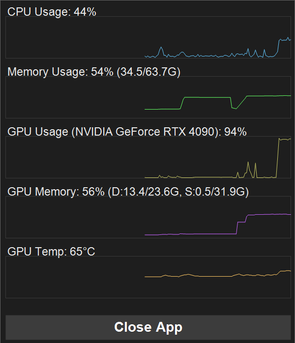

# GpuTray

A lightweight Windows system tray application that monitors GPU performance and system resource usage with real-time dynamic graphs.

 


## Features

- **Dynamic Tray Icon**: 
  - Real-time GPU Usage (TOP line) and GPU Memory (BOTTOM line) graphs directly in the taskbar.
  - Refresh rate: **1 FPS** (Once every second).
  - Dynamic Colors: Green (<50%), Yellow (<80%), Red (>=80%) based on usage levels.
- **Sleek Popup Dashboard** (Right-click):
  - Advanced visualization for 5 key metrics:
    - **CPU**: Usage (%)
    - **Memory**: RAM Utilization (%)
    - **GPU**: Engine Utilization (%), Video Memory (%), Temperature (C)
  - Dark-themed, sleek UI design.
  - One-click exit button.

## Technologies Used

- **C++17**: Modern performance-oriented code.
- **Win32 API**: Low-level Windows system integration.
- **GDI+**: High-quality 2D graphics rendering for icons and dashboards.
- **PDH (Performance Data Helper)**: Precise performance counter gathering.
- **DXGI**: Accurate Video Memory (VRAM) tracking.
- **WMI**: System temperature retrieval.

## Temperature Monitoring Logic

The application uses real-time metrics to ensure accurate GPU temperature readings across different hardware:

### GPU Temperature
1. **Primary (NVML)**: Standard for NVIDIA GPUs. If `nvml.dll` is present, it directly communicates with the NVIDIA Management Library for high-precision real-time metrics.
2. **Fallback (WMI)**: For integrated or non-NVIDIA GPUs, it queries the `Win32_VideoController` WMI class to retrieve available thermal data.

## 🚀 Getting Started

### 📥 Download
You can download the latest version from the [Releases Page](https://github.com/kirinonakar/GpuTray/releases).

## Building from Source

### Prerequisites
- Windows 10/11
- Visual Studio 2019 or later (with C++ CMake tools)
- CMake 3.10+

### Steps
1. Clone the repository.
2. Build the project:
   - **2-1. Manual Build**:
     ```bash
     mkdir build
     cd build
     cmake ..
     cmake --build . --config Release
     ```
   - **2-2. Automated Build**: 
     Simply run `build.bat` in the project root folder.
     (Run `build.bat clean` to delete the old build directory and start from scratch.)
3. Run `GpuTray.exe` from the `build/Release/` directory.

## Usage

- Once launched, look for the small 16x16 graph icon in your system tray.
- **Hover**: View the app name.
- **Right-Click**: Opens the performance dashboard with 5 detailed line graphs.
- **Close**: Click "Close App" at the bottom of the dashboard to terminate.

## License

This project is licensed under the MIT License - see the [LICENSE](LICENSE) file for details.

