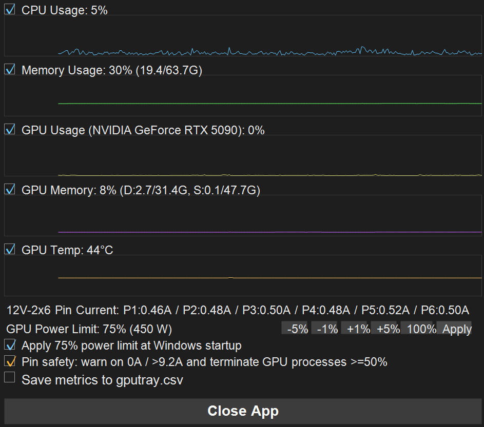

# GpuTray

A lightweight Windows system tray application that monitors GPU performance and system resource usage with real-time dynamic graphs.

 


## Features

- **Dynamic Tray Icon**: 
  - Real-time performance graphs directly in the taskbar.
  - **Customizable**: Select up to 5 metrics (CPU, RAM, GPU, VRAM, GPU Temp, 12V-2x6 pin current) to display simultaneously.
  - Refresh rate: **1 FPS** (Once every second).
  - Dynamic Colors: Green (<50%), Yellow (<80%), Red (>=80%) based on usage levels.
- **CSV Data Logging**:
  - Save performance metrics to `gputray.csv` in real-time.
  - Includes timestamps, CPU/RAM usage, and detailed GPU metrics for later analysis.
- **Sleek Popup Dashboard** (Right-click):
  - Advanced visualization for 5 key metrics:
    - **CPU**: Usage (%)
    - **Memory**: RAM Utilization (%)
    - **GPU**: Engine Utilization (%), Video Memory (%), Temperature (°C)
  - Dark-themed, sleek UI design.
  - One-click exit button.
- **ASUS ROG Astral 12V-2x6 monitoring**:
  - Reads all six pin currents directly from the on-board IT8915FN sensor through read-only NVAPI I2C access.
  - Optional protection warns on a 0 A or >9.2 A pin and, after acknowledgement, terminates processes currently using at least 50% GPU.
- **GPU power limit control**:
  - Adjust from 70% to 100% of the card's BIOS default TDP in 1% steps, matching MSI Afterburner's percentage semantics.
  - Stage changes with -5%, -1%, +1%, +5%, or 100%, then apply them explicitly with the Apply button.
  - Uses NVML and requests administrator approval only when Apply is clicked and the driver requires it.
  - **Apply at Windows startup**: Check "Apply N% power limit at Windows startup" in the dashboard to register a logon scheduled task that silently re-applies the last applied power limit (stored in the registry) every time you sign in. Unchecking removes the task. Enabling/disabling requires one-time administrator approval; the power limit itself is applied without any prompt at startup.

## Technologies Used

- **C++17**: Modern performance-oriented code.
- **Win32 API**: Low-level Windows system integration.
- **GDI+**: High-quality 2D graphics rendering for icons and dashboards.
- **PDH (Performance Data Helper)**: Precise performance counter gathering.
- **DXGI**: Accurate Video Memory (VRAM) tracking.
- **WMI**: System temperature retrieval.

## Temperature Monitoring Logic

The application uses real-time metrics to ensure accurate GPU temperature readings across different hardware:

### GPU Temperature
1. **Primary (NVML)**: Standard for NVIDIA GPUs. If `nvml.dll` is present, it directly communicates with the NVIDIA Management Library for high-precision real-time metrics.
2. **Fallback (WMI)**: For integrated or non-NVIDIA GPUs, it queries the `Win32_VideoController` WMI class to retrieve available thermal data.

## 🚀 Getting Started

### 📥 Download
You can download the latest version from the [Releases Page](https://github.com/kirinonakar/GpuTray/releases).

## Building from Source

### Prerequisites
- Windows 10/11
- Visual Studio 2019 or later (with C++ CMake tools)
- CMake 3.10+

### Steps
1. Clone the repository.
2. Build the project:
   - **2-1. Manual Build**:
     ```bash
     mkdir build
     cd build
     cmake ..
     cmake --build . --config Release
     ```
   - **2-2. Automated Build**: 
     Simply run `build.bat` in the project root folder.
     (Run `build.bat clean` to delete the old build directory and start from scratch.)
3. Run `GpuTray.exe` from the `build/Release/` directory.

## Usage

- Once launched, look for the small 16x16 graph icon in your system tray.
- **Hover**: View the app name.
- **Right-Click**: Opens the performance dashboard with 5 detailed line graphs.
- **Configure**: Use the **checkboxes** next to each metric in the dashboard to toggle its visibility in the system tray. (Maximum 5 items).
- **Logging**: Check "Save metrics to gputray.csv" at the bottom of the dashboard to start recording data.
- **Startup power limit**: Check "Apply N% power limit at Windows startup" below the power limit buttons to apply the saved power limit automatically on every Windows sign-in (an administrator approval is requested once when enabling or disabling).
- **Close**: Click "Close App" at the bottom of the dashboard to terminate.

## License

This project is licensed under the MIT License - see the [LICENSE](LICENSE) file for details.
